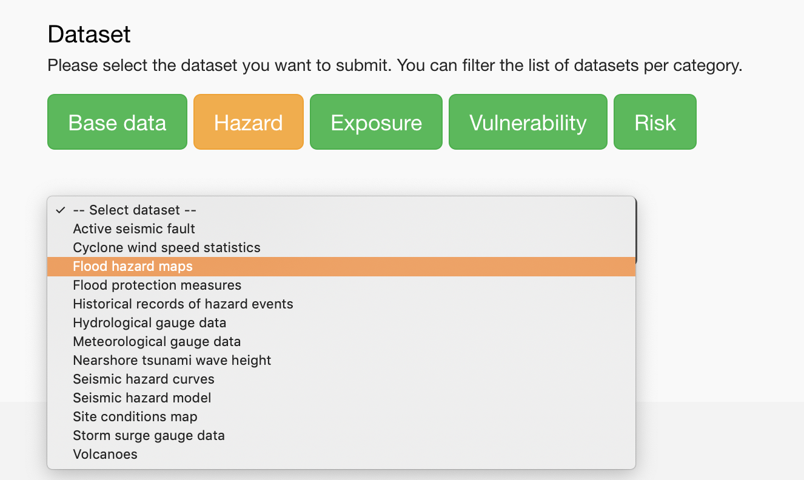

# Why do you use the index?

I'm finishing my PhD in Geotechnical Earthquake Engineering at the Aristotle University of Thessaloniki. Part of my activity is related to finding and submitting earthquake data for Greece and the Balkans area.

# What do you remember from your last visit of the index?

I remember there is a lot of open data.

I remember I was surprised to see Slovenia ranking top.

I remember it was easy to use. It seems it changed a bit since last time, the colours maybe?

I remember I could not see the country score change when I uploaded more than 1 dataset for a same category, and I did not understand why — the openness fields I submitted were different but the score did not change. I do not understand how the scoring system works.

I remember I could not see the different administrative boundaries for Albania, but now it is fixed.

# What is your understanding of the OpenDRI Index

It is a useful site where you can find the sources of various datasets, for specific countries, and their kind of openness.

# Do you use the data?

Yes

# Do you contribute data?

Yes

---

👍 I can find the sources of datasets, which is great when you don't know where to start. I can find additional datasets from there. 

💡 It makes me think more organisations should put their data too. For example: water companies, universities (they do risk assessment, produce flood data, etc.).

❓ What do I think when I see Greece is 45% open data? Well, I don't understand the score. Most datasets don't have a license either. So I don't know how to use the scores. Maybe to compare the openness with other countries?

💡 I somewhat expect datapoints for specific categories. Earthquake datasets should contain informations about shelters or it is incomplete. To me, these datapoints depend of the risk category.

🗣 Maybe the score should be for each hazard instead.

🤔 I'm not sure if showing a percentage is good. Maybe low/medium/high openness would be sufficient. At least, I expect something leaning more towards the  _quality_ of the open data.

# What about the license, why do you think Greece datasets are not published with a license?

🗣 I think institutions are not very informed about them.

🗣 Even with no license I would use the data. I benefit from an academic context where I can use the data as long as I explicitly mention its source. A regular civil engineer might not be able to do that.

☹️ A blocker, for me, is when a dataset is not available in bulk.

🗣 As long as I can download a dataset, I can use it. Also, usually, the university doesn't pay for data.

# Tell me more about your experience in submitting datasets

🗣 First, I have to find a/the source.

🤔 I was confused by some fields, I was not sure if the answer was Yes or No.

😖 Take the license for example: one of the dataset was "free to use", it had no explicit license so I did not know if I had to tick Yes or No, for the License field.

🔗 (_we navigate to [dataset_details.html?keyds=268](https://index.opendri.org/dataset_details.html?keyds=268)_)

😖 In this case, it is a map but they are PDF files, it is not that useful for maps.

😖 Also, the dataset website changed so I cannot find the data anymore.

🤔 Although some data are open, it is not as trivial to check the validity of the data — I can maybe trust a university more than some other organisations?

(_back to submitting dataset_)

😩 I remember a bug when submitting dataset where I would lose my data. I tried to edit one of the 3 datasets bound to a same category, the data were blank on the form. I had to delete the dataset and try again.

🔗 (_we navigate to [dataset_details.html?keyds=355](https://index.opendri.org/dataset_details.html?keyds=355)_)

🤔 I expected to see other related datasets.

🔗 (_we navigate to [dataset_details.html?keyds=437](https://index.opendri.org/dataset_details.html?keyds=437)_)

🙂 Ah, maybe it is this one. I see the related dataset.

🔗 (_we navigate to [dataset_details.html?keyds=229](https://index.opendri.org/dataset_details.html?keyds=229)_)

😠 When I click on "Submit a dataset", then "My datasets", it takes a while to load (and there is no loading indicator but a blank space in the page, the datasets appear a few seconds later)

👍 a Title field! I used to put the title in the "Dataset comments". It's great!

🔗 (_we navigate to [dataset_list.html?idcountry=GR](https://index.opendri.org/dataset_list.html?idcountry=GR)_)

🤔 I do not get the icons. There is an "Earthquake" icon but where can I say I submit an "Earthquake" related dataset?

🤔 The submit interface is confusing, hazard wise: I cannot understand how to assign the dataset to a specific hazard. I can see "flood hazard maps" but not tsunami.

😠 Likewise for seismic related datasets. I have a dataset which is a seismic map: it's not a "seismic curve", it is not a "seismic model". I always used "seismic model" but I know it is not a model, it is not the right category.

---

❓ "Global data"… what is the difference?

😯 "Submitted: 19", that's it "for the world"? It does seem like an odd number.

😮 Ah, they are not necessarily worldwide! They can also cover multiple regions of the world!

# Was it useful to you to have this one hour conversation?

- it was a good excuse to explore the website
- it feels good to participate again
- it feels great to create a database with its users
